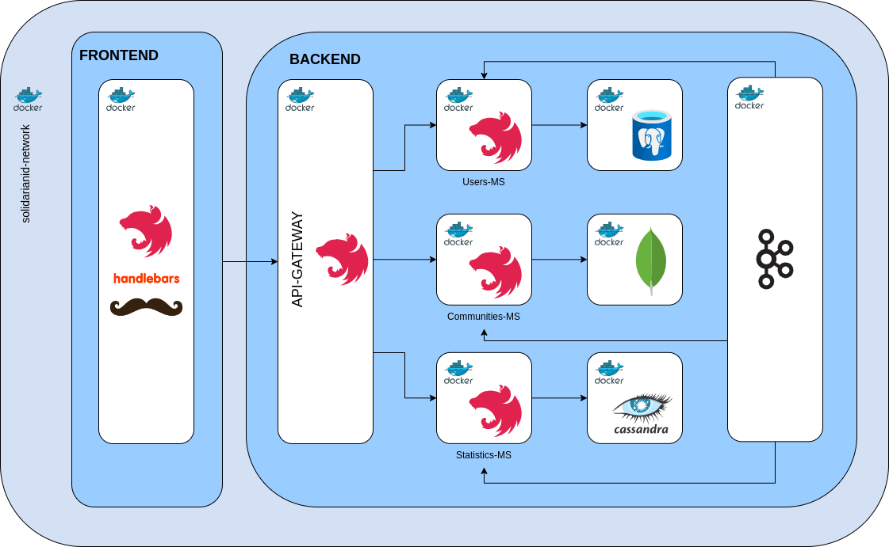
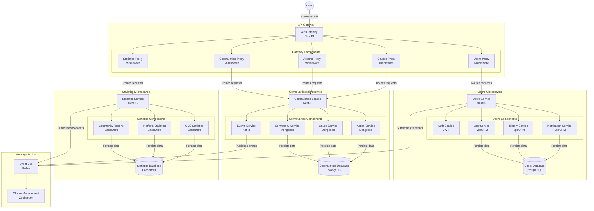
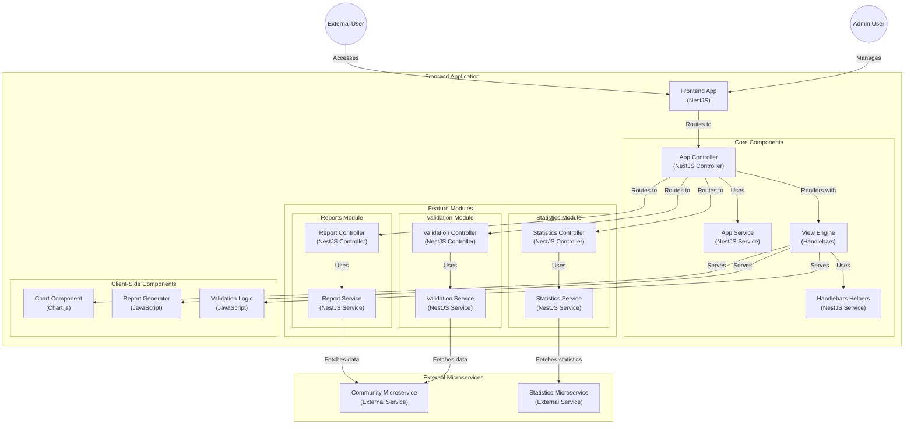
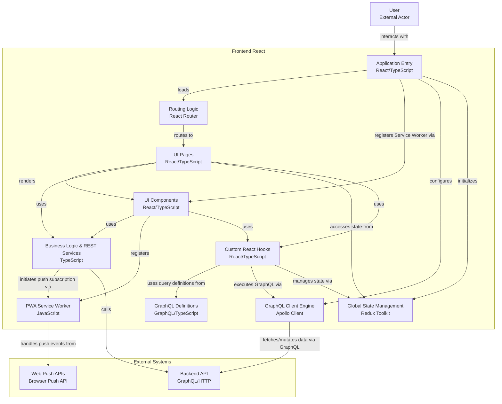
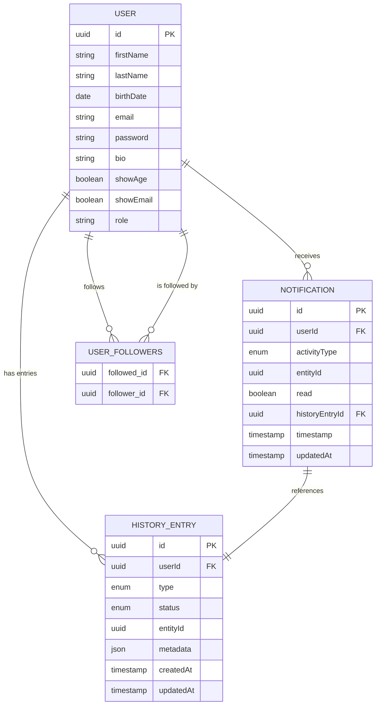
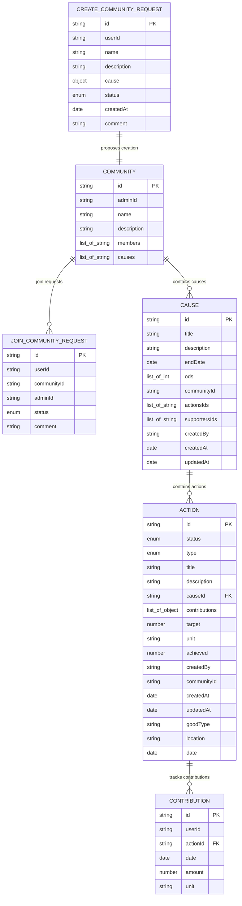
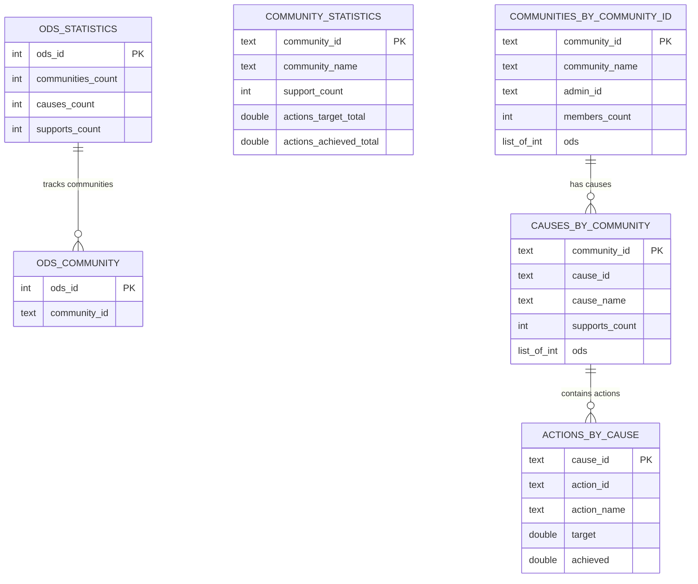
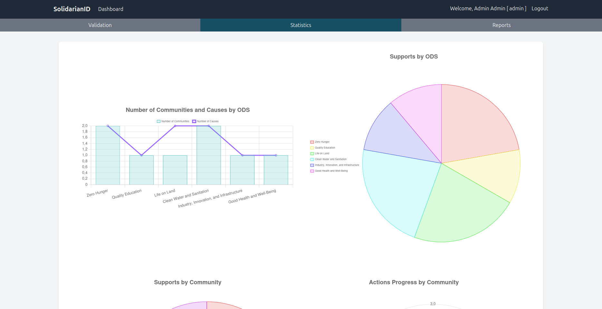
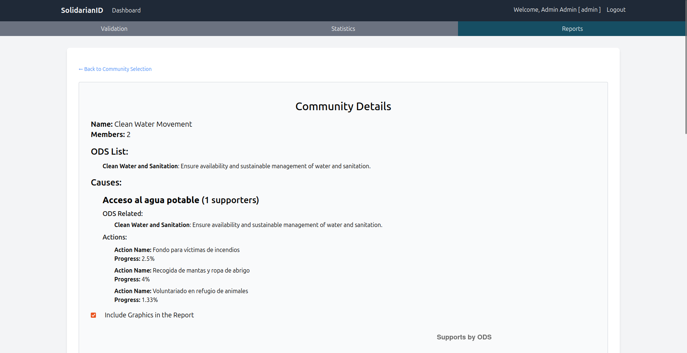
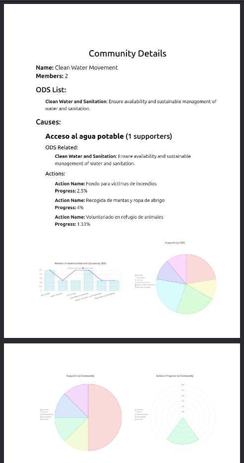

# SolidarianID

**SolidarianID** es el caso de estudio común desarrollado transversalmente en todas las asignaturas obligatorias del **Máster en Ingeniería del Software** de la **Universidad de Murcia**. Es una plataforma digital impulsada por la ONG _Voluntarios Sin Fronteras_, cuyo objetivo es fomentar la participación ciudadana en causas solidarias a nivel internacional.

La plataforma permite a los usuarios registrarse, crear o unirse a comunidades, dar visibilidad a causas solidarias, participar en acciones concretas (donaciones, voluntariado, eventos) y mantener un historial completo de su actividad solidaria mediante una identidad digital única. Además, SolidarianID incluye funcionalidades sociales como seguimiento de usuarios, valoraciones, comentarios e interacciones privadas.

## Índice

- [SolidarianID](#solidarianid)
  - [Índice](#índice)
  - [Despliegue](#despliegue)
    - [Requisitos](#requisitos)
    - [Comandos principales](#comandos-principales)
    - [Datos de prueba](#datos-de-prueba)
    - [Servicios](#servicios)
      - [Frontend](#frontend)
      - [Backend](#backend)
      - [Documentación de APIs](#documentación-de-apis)
  - [Asignaturas](#asignaturas)
    - [Desarrollo Full-Stack](#desarrollo-full-stack)
      - [Backend](#backend-1)
      - [Frontend](#frontend-1)
    - [Arquitectura de Datos](#arquitectura-de-datos)
    - [Control de Calidad y Pruebas del Software](#control-de-calidad-y-pruebas-del-software)
    - [Desarrollo de Software en la Nube](#desarrollo-de-software-en-la-nube)
    - [Prácticas Continuas](#prácticas-continuas)
    - [Gestión Ágil de Proyectos](#gestión-ágil-de-proyectos)
  - [Galería de capturas](#galería-de-capturas)
    - [Inicio](#inicio)
    - [Perfil de usuario](#perfil-de-usuario)
    - [Notificaciones](#notificaciones)
    - [Comunidades](#comunidades)
    - [Causas](#causas)
    - [Acciones](#acciones)
    - [Panel de Administración y Estadísticas](#panel-de-administración-y-estadísticas)
  - [Autores \& Copyright](#autores--copyright)

## Despliegue

Esta sección describe los pasos necesarios para desplegar SolidarianID en un entorno de producción utilizando contenedores.

### Requisitos

Asegúrate de tener instalado:

- Docker
- Docker Compose
- Make

### Comandos principales

| Comando               | Descripción                                       |
| --------------------- | ------------------------------------------------- |
| `make create-network` | Crea la red Docker necesaria para el despliegue.  |
| `make run-prod`       | Despliega todos los servicios en modo producción. |
| `make stop-prod`      | Detiene todos los servicios desplegados.          |
| `make help`           | Muestra la lista de comandos disponibles.         |

### Datos de prueba

Para cargar datos de prueba, primero ejecuta `make run-prod`. Luego, ejecuta:

```sh
cd scripts/test_data_loader
python3 test_data_loader.py
```

Los datos generados se encuentran en `scripts/test_data_loader/data/*.json`.

**Credenciales del usuario administrador:**

- **Email:** `admin@admin.com`
- **Contraseña:** `123456Test*`

### Servicios

Principales servicios de la plataforma:

#### Frontend

- **Directorio:** `frontend/`
- **URL:** [http://localhost:5173](http://localhost:5173)

#### Backend

- **Directorio:** `backend/`
- **API Gateway:** [http://localhost:3000/api/v1](http://localhost:3000/api/v1)
- **Servicio de Usuarios:** [http://localhost:3001/users](http://localhost:3001/users)
- **Servicio de Comunidades:** [http://localhost:3002/communities](http://localhost:3002/communities)
- **Servicio de Estadísticas:** [http://localhost:3003/statistics](http://localhost:3003/statistics)

#### Documentación de APIs

- **Usuarios:** [http://localhost:3000/api/v1/doc/users](http://localhost:3000/api/v1/doc/users)
- **Comunidades:** [http://localhost:3000/api/v1/doc/communities](http://localhost:3000/api/v1/doc/communities)

## Asignaturas

### Desarrollo Full-Stack

- [📄 Documentación completa. Cuatrimestre 1.](./doc/Memoria%20DFS_C1%20para%20SolidarianID.pdf)
- [📄 Documentación completa. Cuatrimestre 2.](./doc/Memoria%20DFS_C2%20para%20SolidarianID.pdf)


En esta asignatura se abordó el desarrollo integral del MVP de SolidarianID, aplicando principios de **Domain-Driven Design (DDD)**, arquitectura limpia y separación por capas. El sistema evolucionó de un diseño monolítico MVC a una arquitectura de **microservicios** orientada a eventos.

A continuación se muestra el diagrama de arquitectura de los principales contenedores y microservicios del backend, así como sus relaciones y flujos de comunicación.



#### Backend

- **Arquitectura aplicada:**
  - Modelado de negocio con DDD.
  - Event Sourcing y CQRS en el microservicio de estadísticas.
  - Comunicación entre microservicios mediante Kafka.
  - Organización en bounded contexts: usuarios, comunidades, estadísticas.
- **API Gateway:** Endpoints REST con proxies a cada microservicio y documentación OpenAPI.
- **GraphQL:** Módulo para exponer datos de forma flexible, útil para clientes móviles y SPA.
- **Seguridad:** Autenticación OAuth2, emisión de tokens JWT y control de acceso por roles y permisos.

A continuación se presenta un diagrama que ilustra la estructura general del backend. Este diagrama muestra la disposición de los principales microservicios, sus componentes internos, las bases de datos utilizadas y los mecanismos de comunicación entre ellos.



#### Frontend

El frontend evolucionó de una interfaz básica renderizada en servidor a una arquitectura moderna basada en componentes.

- **Handlebars (HBS):**
  - Primera versión basada en plantillas Handlebars (MVC).
  - Funcionalidades para administrador: estadísticas y gestión de comunidades.
  - Renderizado en servidor y estilo responsive con Bootstrap.

A continuación se presenta un diagrama que ilustra la arquitectura del frontend NestJS y HBS, destacando la organización de módulos funcionales, los componentes internos y la interacción con microservicios externos.



- **React:**
  - Migración a SPA en React para mayor interactividad y modularidad.
  - Módulos: interacción de usuario, búsqueda y filtrado, autenticación, historial, perfil, seguimiento y apoyo a causas.
  - Estado con React Hooks y consumo de API REST con fetch y JWT.

El siguiente diagrama representa la arquitectura del frontend React. Se detallan los flujos principales desde la entrada de la aplicación hasta la gestión del estado global, el uso de GraphQL, los servicios REST, y la integración de funcionalidades PWA como el service worker y notificaciones push.



- **Next.js:**

  - Integración para mejorar rendimiento y SEO (SSR + SSG).
  - Rutas dinámicas y adaptación progresiva desde SPA.
  - Navegación optimizada con _prefetch_.

- **Progressive Web App (PWA):**
  - Acceso sin conexión, carga rápida y mejor experiencia móvil.

Esta evolución consolidó un frontend desacoplado, escalable y alineado con las mejores prácticas del desarrollo web moderno.

### Arquitectura de Datos

- [📄 Documentación completa.](./doc/Memoria%20AD%20para%20SolidarianID.pdf)


La arquitectura de datos se diseñó siguiendo un enfoque **políglota**, empleando diferentes bases de datos según los requerimientos de cada subsistema:

- **PostgreSQL** (TypeORM): datos estructurados y relacionales (usuarios, credenciales, historial).



- **MongoDB** (Mongoose): entidades con estructuras dinámicas (comunidades, causas, acciones).



- **Apache Cassandra**: almacenamiento distribuido para métricas y estadísticas agregadas, permitiendo alta disponibilidad y escalabilidad horizontal.



La arquitectura incorpora un sistema de eventos basado en Kafka para sincronización y consistencia eventual entre microservicios.

### Control de Calidad y Pruebas del Software

- [📄 Documentación completa.](./doc/Memoria%20CCPS%20para%20SolidarianID.pdf)


Esta asignatura se centró en asegurar la calidad del MVP mediante actividades de verificación, validación y automatización de pruebas a nivel frontend, backend y sistema.

- **Plan de pruebas ágil:** definición de escenarios, estrategia de pruebas y métricas de calidad.
- **Revisión estática de código:** aplicación de reglas de estilo mediante ESLint y Prettier.
- **Análisis estático con SonarQube:** evaluación de cobertura, duplicidad, code smells y mantenibilidad.
- **Pruebas unitarias y de mutación:** tests en Jest y evaluación con Stryker para mejorar su efectividad.
- **Pruebas de frontend:** verificación de componentes con @testing-library/react y jest-dom.
- **Pruebas de backend:** tests sobre endpoints usando Supertest, ficheros `.rest` y entornos de prueba aislados.
- **Pruebas e2e:** con Cypress.
- **Pruebas de rendimiento:** usando JMeter para evaluar el rendimiento bajo carga (APDEX, throughput, latencia).
- **Pruebas metamórficas y de regresión:** exploración de técnicas avanzadas orientadas a confiabilidad y mantenimiento.

Estas acciones garantizaron la robustez, mantenibilidad y desempeño del sistema antes del despliegue en producción.

### Desarrollo de Software en la Nube

- [📄 Documentación completa.](./doc/Memoria%20DSEN%20para%20SolidarianID.pdf)


Se diseñaron y desplegaron funcionalidades serverless sobre AWS para extender SolidarianID hacia una arquitectura escalable y modular, explorando servicios gestionados de Amazon Web Services.

Funcionalidades clave:

- Apoyo anónimo a causas mediante API Gateway, AWS Lambda y DynamoDB.
- Migración parcial de la entidad Cause a DynamoDB.
- Generación automática de avatares con Lambda y almacenamiento en S3.

Estas implementaciones se integran sin afectar la lógica principal del backend, manteniendo una arquitectura flexible y preparada para producción cloud.

### Prácticas Continuas

- [📄 Documentación completa.](./doc/Memoria%20PC%20para%20SolidarianID.pdf)


Se diseñó e implementó un pipeline completo de Integración Continua (CI) y Despliegue Continuo (CD) para SolidarianID, automatizando el flujo de desarrollo, pruebas y despliegue.

El pipeline en GitHub Actions incluye 4 etapas:

- **CODE:** validación de estilo.
- **BUILD:** compilación y construcción de imágenes Docker.
- **TEST:** pruebas unitarias y e2e.
- **DEPLOY:** subida de imágenes a ECR y despliegue en EC2.

Este proceso garantiza consistencia, reduce errores y acelera la entrega continua.

### Gestión Ágil de Proyectos

- [📄 Documentación completa.](./doc/Memoria%20GAP%20para%20SolidarianID.pdf)


Se definió la visión global del proyecto aplicando metodologías ágiles. Se identificó el MVP y se organizó el desarrollo en iteraciones gestionadas con Scrum.

- **Definición del MVP y roadmap:** artefactos clave, análisis de alcance y planificación de versiones.
- **Planificación de la 1ª iteración:** Sprint Backlog, DoD, criterios de aceptación y tablero Scrum.
- **Gestión avanzada:** análisis de Peopleware, riesgos, escalado ágil (SAFe®) y Secure Scrum.

Este marco alineó las decisiones técnicas con una planificación ágil, centrada en entregar valor de forma iterativa y sostenible.

## Galería de capturas

A continuación se muestran capturas representativas de la plataforma SolidarianID.

### Inicio


### Perfil de usuario


### Notificaciones


### Comunidades

- **Listado de comunidades**

  

- **Detalles de una comunidad**

  

- **Solicitud de creación de comunidad**

  

### Causas

- **Listado de causas**

  

- **Crear una nueva causa**

  

- **Detalles de una causa**

  

### Acciones

- **Listado de acciones**

  

- **Detalles de una acción**

  

- **Detalles de una acción específica**

  

### Panel de Administración y Estadísticas

- **Validación de creación de comunidades:**

  

- **Visualización de estadísticas:**

  

- **Generación y consulta de informes:**

  

- **Descarga de informes en PDF:**

  

## Autores & Copyright

Este proyecto ha sido desarrollado por los siguientes autores en el marco del **Máster en Ingeniería del Software** de la **Universidad de Murcia**:

- **Hernán Salambay Roldán**
- **Pedro Nicolás Gomariz**
- **Alejandro Montoya Toro**
- **Aurora Hervás López**
- **Dongyue Yu**

Todos los derechos reservados © 2025.

El contenido de este repositorio, salvo que se indique lo contrario, está protegido por la legislación vigente sobre propiedad intelectual. El uso, reproducción o distribución total o parcial del material requiere el consentimiento expreso de los autores.

Para consultas académicas, colaboraciones o permisos, contactar con los autores a través de la Universidad de Murcia.
