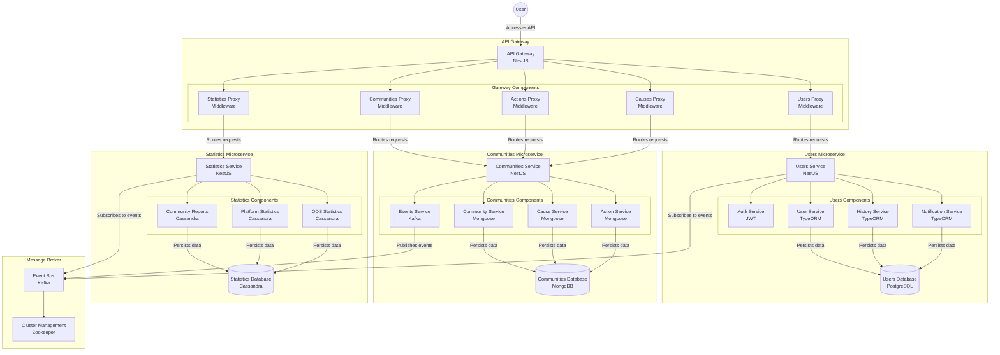
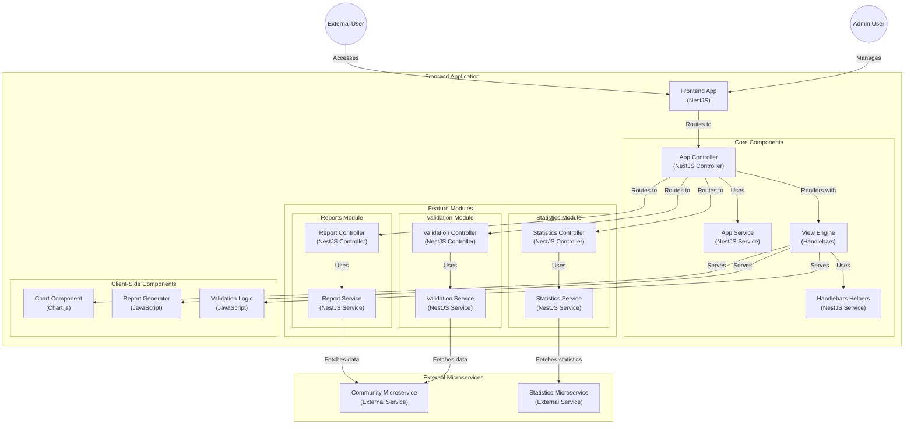

# SolidarianID

Repository for the SolidarianID project.

## Main Commands

To create the necessary network for the production environment, run:

```sh
make create-network
```

To start the production application, run:

```sh
make run-prod
```

To stop the production application, run:

```sh
make stop-prod
```

To see other commands of interest, run:

```sh
make help
```

## Services

### Frontend

Location: `frontend/`  
URL: [http://localhost:3005](http://localhost:3005)

### Backend

Location: `backend/`  
API-Gateway URL: [http://localhost:3000/api/v1](http://localhost:3000/api/v1)

#### Microservices URLs

- **User Microservice Base URL:** [http://localhost:3001/users](http://localhost:3001/users)
- **Community Microservice Base URL:** [http://localhost:3002/communities](http://localhost:3002/communities)
- **Statistics Microservice Base URL:** [http://localhost:3003/statistics](http://localhost:3003/statistics)

### Public Documentation

- [User API Documentation](http://localhost:3000/api/v1/doc/users)
- [Community API Documentation](http://localhost:3000/api/v1/doc/communities)

## Backend Software Architecture Diagram



## Frontend Software Architecture Diagram



## Requirements

Make sure you have the following components installed:

- Docker
- Docker Compose
- make
