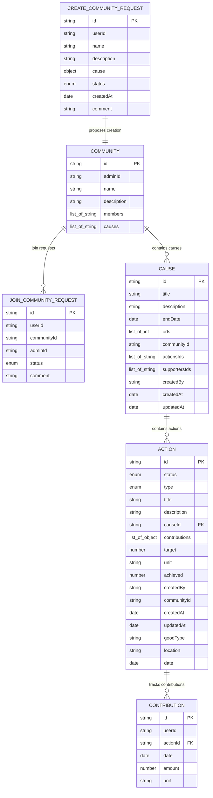

```mermaid
erDiagram
    JOIN_COMMUNITY_REQUEST {
        string id PK
        string userId
        string communityId
        string adminId
        enum status
        string comment
    }
    COMMUNITY {
        string id PK
        string adminId
        string name
        string description
        list_of_string members
        list_of_string causes
    }
    CREATE_COMMUNITY_REQUEST {
        string id PK
        string userId
        string name
        string description
        object cause
        enum status
        date createdAt
        string comment
    }
    CAUSE {
        string id PK
        string title
        string description
        date endDate
        list_of_int ods
        string communityId
        list_of_string actionsIds
        list_of_string supportersIds
        string createdBy
        date createdAt
        date updatedAt
    }
    ACTION {
        string id PK
        enum status
        enum type
        string title
        string description
        string causeId FK
        list_of_object contributions
        number target
        string unit
        number achieved
        string createdBy
        string communityId
        date createdAt
        date updatedAt
        string goodType
        string location
        date date
    }
    CONTRIBUTION {
        string id PK
        string userId
        string actionId FK
        date date
        number amount
        string unit
    }

    COMMUNITY ||--o{ JOIN_COMMUNITY_REQUEST : "join requests"
    CREATE_COMMUNITY_REQUEST ||--|| COMMUNITY : "proposes creation"
    COMMUNITY ||--o{ CAUSE : "contains causes"
    CAUSE ||--o{ ACTION : "contains actions"
    ACTION ||--o{ CONTRIBUTION : "tracks contributions"
```
