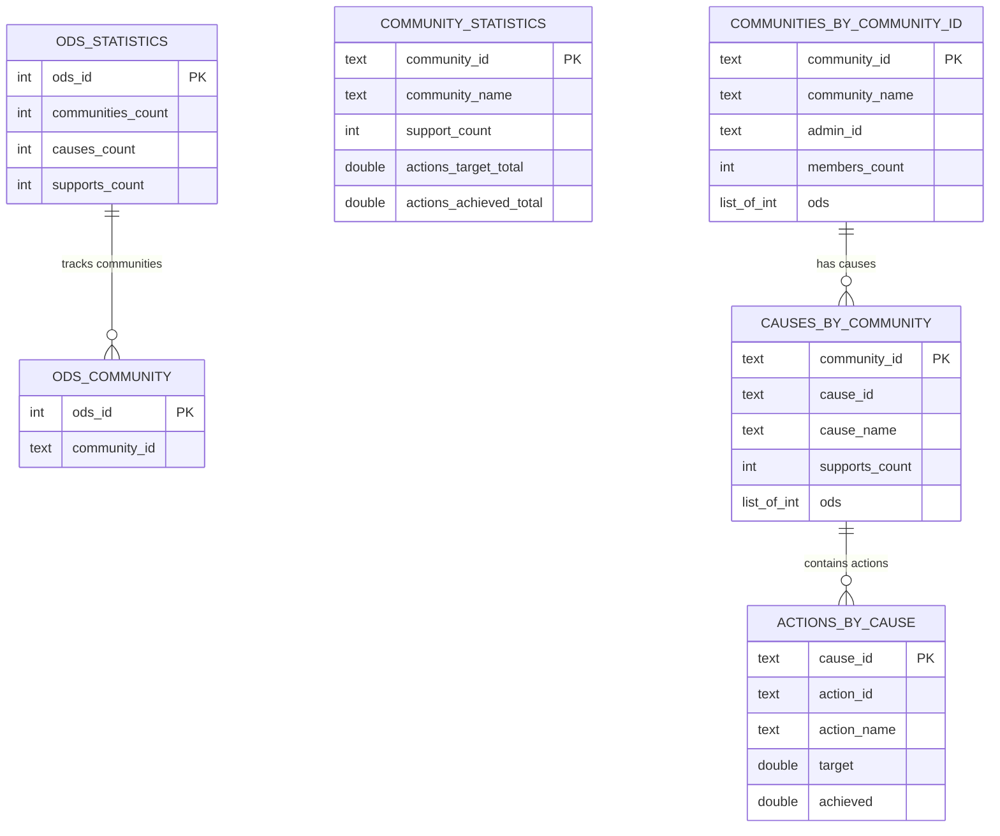

```mermaid
erDiagram
    ODS_STATISTICS {
        int ods_id PK
        int communities_count
        int causes_count
        int supports_count
    }

    ODS_COMMUNITY {
        int ods_id PK
        text community_id
    }

    COMMUNITY_STATISTICS {
        text community_id PK
        text community_name
        int support_count
        double actions_target_total
        double actions_achieved_total
    }

    COMMUNITIES_BY_COMMUNITY_ID {
        text community_id PK
        text community_name
        text admin_id
        int members_count
        list_of_int ods
    }

    CAUSES_BY_COMMUNITY {
        text community_id PK
        text cause_id
        text cause_name
        int supports_count
        list_of_int ods
    }

    ACTIONS_BY_CAUSE {
        text cause_id PK
        text action_id
        text action_name
        double target
        double achieved
    }

    ODS_STATISTICS ||--o{ ODS_COMMUNITY : "tracks communities"
    COMMUNITIES_BY_COMMUNITY_ID ||--o{ CAUSES_BY_COMMUNITY : "has causes"
    CAUSES_BY_COMMUNITY ||--o{ ACTIONS_BY_CAUSE : "contains actions"
```
