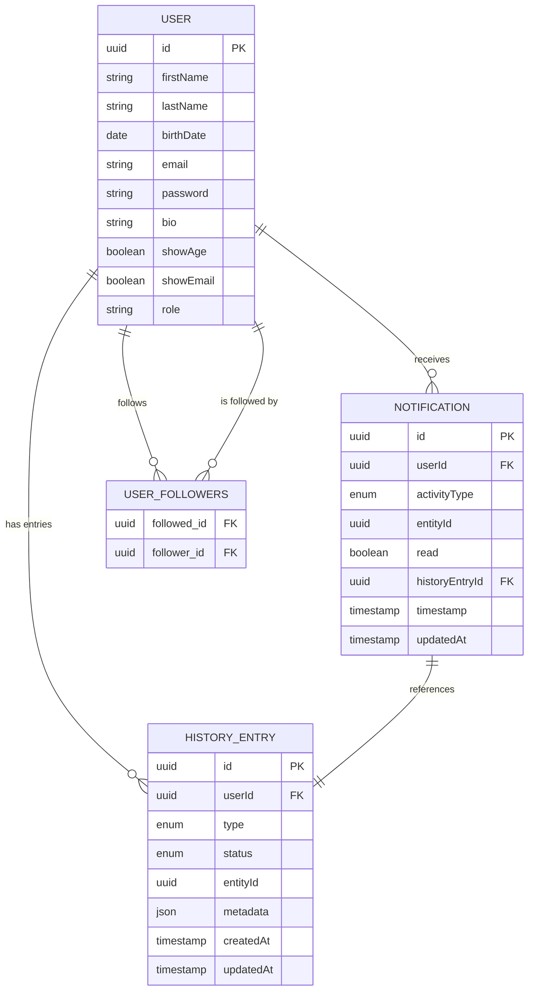

```mermaid
erDiagram
    USER {
        uuid id PK
        string firstName
        string lastName
        date birthDate
        string email
        string password
        string bio
        boolean showAge
        boolean showEmail
        string role
    }

    NOTIFICATION {
        uuid id PK
        uuid userId FK
        enum activityType
        uuid entityId
        boolean read
        uuid historyEntryId FK
        timestamp timestamp
        timestamp updatedAt
    }

    HISTORY_ENTRY {
        uuid id PK
        uuid userId FK
        enum type
        enum status
        uuid entityId
        json metadata
        timestamp createdAt
        timestamp updatedAt
    }

    USER_FOLLOWERS {
        uuid followed_id FK
        uuid follower_id FK
    }

    USER ||--o{ NOTIFICATION : "receives"
    USER ||--o{ HISTORY_ENTRY : "has entries"
    USER ||--o{ USER_FOLLOWERS : "follows"
    USER ||--o{ USER_FOLLOWERS : "is followed by"
    NOTIFICATION ||--|| HISTORY_ENTRY : "references"
```
