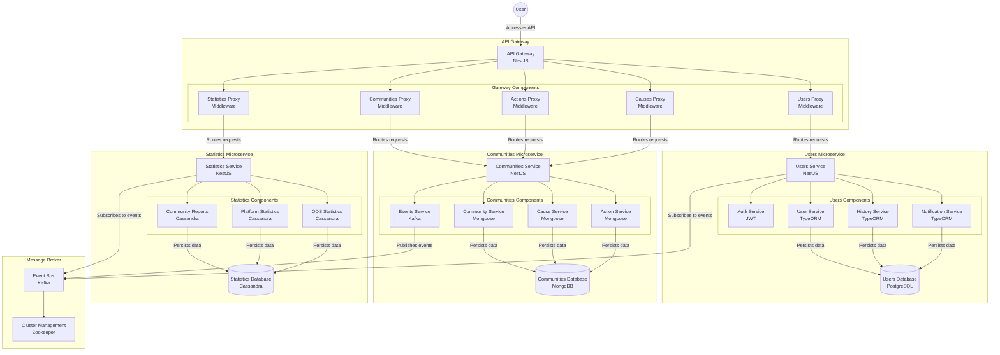

```mermaid
graph TB
    User((User))

    subgraph "API Gateway"
        APIGateway["API Gateway<br>NestJS"]

        subgraph "Gateway Components"
            UsersProxy["Users Proxy<br>Middleware"]
            CommProxy["Communities Proxy<br>Middleware"]
            StatProxy["Statistics Proxy<br>Middleware"]
            ActionsProxy["Actions Proxy<br>Middleware"]
            CausesProxy["Causes Proxy<br>Middleware"]
        end
    end

    subgraph "Users Microservice"
        UserMS["Users Service<br>NestJS"]

        subgraph "Users Components"
            AuthService["Auth Service<br>JWT"]
            UserService["User Service<br>TypeORM"]
            HistoryService["History Service<br>TypeORM"]
            NotifService["Notification Service<br>TypeORM"]
        end

        UsersDB[("Users Database<br>PostgreSQL")]
    end

    subgraph "Communities Microservice"
        CommMS["Communities Service<br>NestJS"]

        subgraph "Communities Components"
            CommunityService["Community Service<br>Mongoose"]
            CauseService["Cause Service<br>Mongoose"]
            ActionService["Action Service<br>Mongoose"]
            CommEventsService["Events Service<br>Kafka"]
        end

        CommDB[("Communities Database<br>MongoDB")]
    end

    subgraph "Statistics Microservice"
        StatMS["Statistics Service<br>NestJS"]

        subgraph "Statistics Components"
            CommReports["Community Reports<br>Cassandra"]
            PlatformStats["Platform Statistics<br>Cassandra"]
            OdsStats["ODS Statistics<br>Cassandra"]
        end

        StatsDB[("Statistics Database<br>Cassandra")]
    end

    subgraph "Message Broker"
        Kafka["Event Bus<br>Kafka"]
        Zookeeper["Cluster Management<br>Zookeeper"]
    end

    %% User interactions
    User -->|"Accesses API"| APIGateway

    %% API Gateway routing
    APIGateway --> UsersProxy
    APIGateway --> CommProxy
    APIGateway --> StatProxy
    APIGateway --> ActionsProxy
    APIGateway --> CausesProxy

    %% Proxy routing to services
    UsersProxy -->|"Routes requests"| UserMS
    CommProxy -->|"Routes requests"| CommMS
    StatProxy -->|"Routes requests"| StatMS
    ActionsProxy -->|"Routes requests"| CommMS
    CausesProxy -->|"Routes requests"| CommMS

    %% Service component relationships
    UserMS --> AuthService
    UserMS --> UserService
    UserMS --> HistoryService
    UserMS --> NotifService

    CommMS --> CommunityService
    CommMS --> CauseService
    CommMS --> ActionService
    CommMS --> CommEventsService

    StatMS --> CommReports
    StatMS --> PlatformStats
    StatMS --> OdsStats

    %% Database connections
    UserService -->|"Persists data"| UsersDB
    HistoryService -->|"Persists data"| UsersDB
    NotifService -->|"Persists data"| UsersDB

    CommunityService -->|"Persists data"| CommDB
    CauseService -->|"Persists data"| CommDB
    ActionService -->|"Persists data"| CommDB

    CommReports -->|"Persists data"| StatsDB
    PlatformStats -->|"Persists data"| StatsDB
    OdsStats -->|"Persists data"| StatsDB

    %% Event communication
    Kafka --> Zookeeper
    CommEventsService -->|"Publishes events"| Kafka
    UserMS -->|"Subscribes to events"| Kafka
    StatMS -->|"Subscribes to events"| Kafka
```
