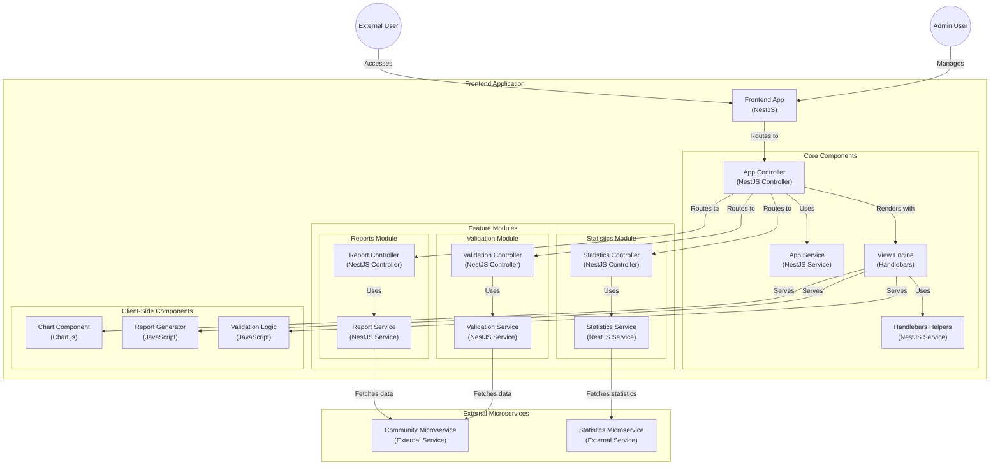

```mermaid
graph TB
    User((External User))
    Admin((Admin User))

    subgraph "Frontend Application"
        direction TB
        FrontendApp["Frontend App<br>(NestJS)"]

        subgraph "Core Components"
            AppController["App Controller<br>(NestJS Controller)"]
            AppService["App Service<br>(NestJS Service)"]
            ViewEngine["View Engine<br>(Handlebars)"]
            HelperService["Handlebars Helpers<br>(NestJS Service)"]
        end

        subgraph "Feature Modules"
            direction LR
            subgraph "Reports Module"
                ReportController["Report Controller<br>(NestJS Controller)"]
                ReportService["Report Service<br>(NestJS Service)"]
            end

            subgraph "Statistics Module"
                StatController["Statistics Controller<br>(NestJS Controller)"]
                StatService["Statistics Service<br>(NestJS Service)"]
            end

            subgraph "Validation Module"
                ValidController["Validation Controller<br>(NestJS Controller)"]
                ValidService["Validation Service<br>(NestJS Service)"]
            end
        end

        subgraph "Client-Side Components"
            ChartJS["Chart Component<br>(Chart.js)"]
            ReportGen["Report Generator<br>(JavaScript)"]
            Validation["Validation Logic<br>(JavaScript)"]
        end
    end

    subgraph "External Microservices"
        CommunityMS["Community Microservice<br>(External Service)"]
        StatisticsMS["Statistics Microservice<br>(External Service)"]
    end

    %% User interactions
    User -->|"Accesses"| FrontendApp
    Admin -->|"Manages"| FrontendApp

    %% Frontend internal connections
    FrontendApp -->|"Routes to"| AppController
    AppController -->|"Uses"| AppService
    AppController -->|"Renders with"| ViewEngine
    ViewEngine -->|"Uses"| HelperService

    %% Module connections
    AppController -->|"Routes to"| ReportController
    AppController -->|"Routes to"| StatController
    AppController -->|"Routes to"| ValidController

    ReportController -->|"Uses"| ReportService
    StatController -->|"Uses"| StatService
    ValidController -->|"Uses"| ValidService

    %% Client-side connections
    ViewEngine -->|"Serves"| ChartJS
    ViewEngine -->|"Serves"| ReportGen
    ViewEngine -->|"Serves"| Validation

    %% External service connections
    ReportService -->|"Fetches data"| CommunityMS
    ValidService -->|"Fetches data"| CommunityMS
    StatService -->|"Fetches statistics"| StatisticsMS
```
