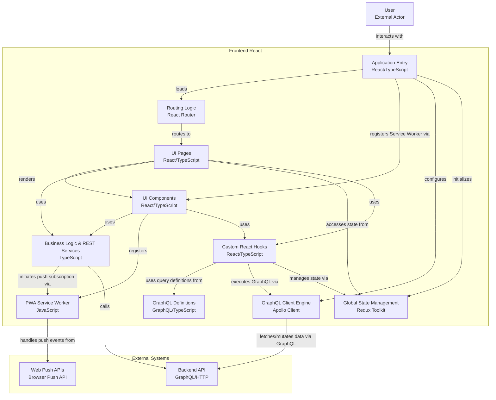

```mermaid
graph TD

    user["User<br>External Actor"]
    subgraph external["External Systems"]
        backend["Backend API<br>GraphQL/HTTP"]
        pushapi["Web Push APIs<br>Browser Push API"]
    end
    subgraph frontend["Frontend React"]
        entry["Application Entry<br>React/TypeScript"]
        routing["Routing Logic<br>React Router"]
        pages["UI Pages<br>React/TypeScript"]
        components["UI Components<br>React/TypeScript"]
        logic["Business Logic &amp; REST Services<br>TypeScript"]
        gqlDefs["GraphQL Definitions<br>GraphQL/TypeScript"]
        gqlClient["GraphQL Client Engine<br>Apollo Client"]
        state["Global State Management<br>Redux Toolkit"]
        sw["PWA Service Worker<br>JavaScript"]
        hooks["Custom React Hooks<br>React/TypeScript"]

        entry -->|loads| routing
        entry -->|registers Service Worker via| components
        entry -->|configures| gqlClient
        entry -->|initializes| state
        routing -->|routes to| pages
        pages -->|renders| components
        pages -->|uses| logic
        pages -->|accesses state from| state
        pages -->|uses| hooks
        components -->|uses| logic
        components -->|registers| sw
        components -->|uses| hooks
        hooks -->|uses query definitions from| gqlDefs
        hooks -->|executes GraphQL via| gqlClient
        hooks -->|manages state via| state
        logic -->|initiates push subscription via| sw
    end

    user -->|interacts with| entry
    logic -->|calls| backend
    gqlClient -->|fetches/mutates data via GraphQL| backend
    sw -->|handles push events from| pushapi
```
