# SolidarianID - Frontend Documentation

This document contains screenshots of different views from the SolidarianID frontend.

---

## Screenshots

### Home

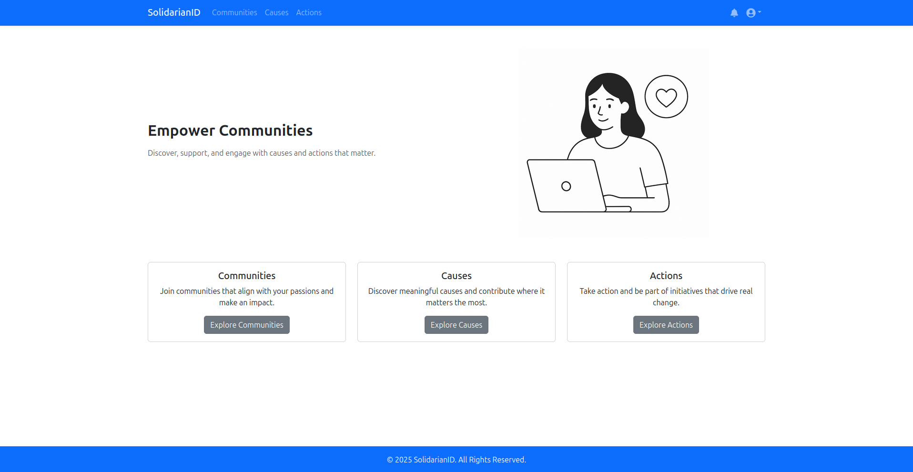

### User Profile

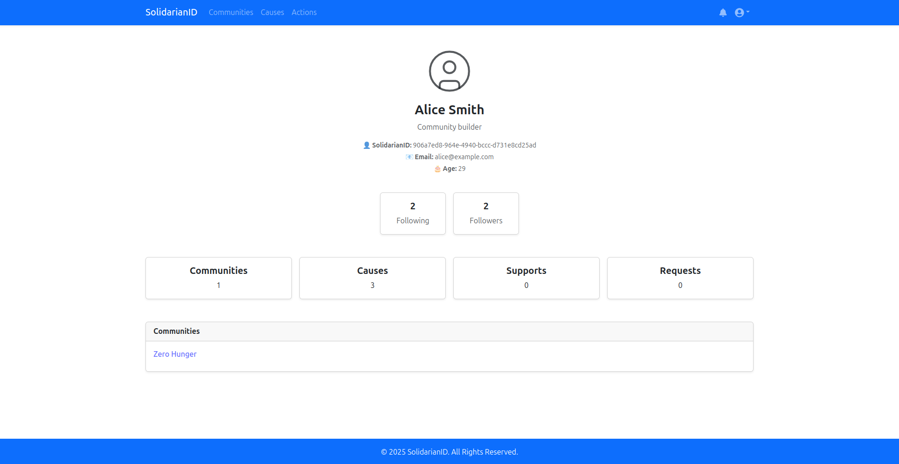

### Notifications

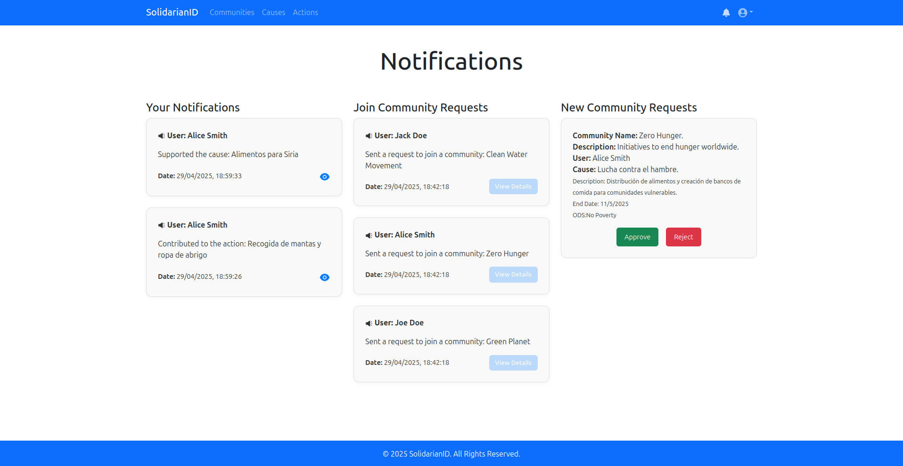

### Communities

- **List of communities**

  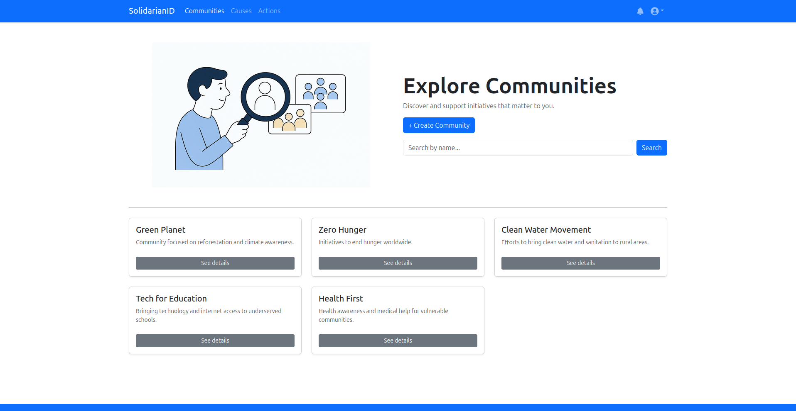

- **Community details (community by ID)**

  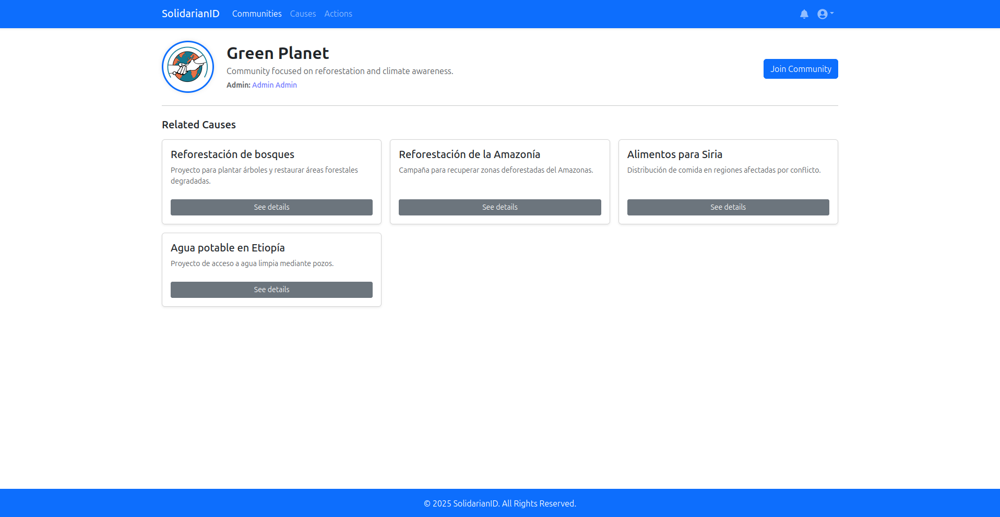

- **Community creation request**

  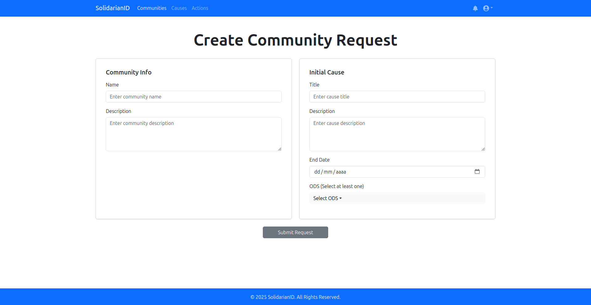

### Causes

- **List of causes**

  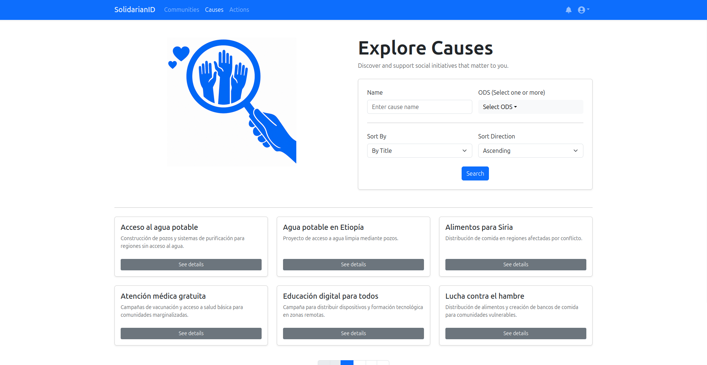

- **Create a new cause in a specific community**

  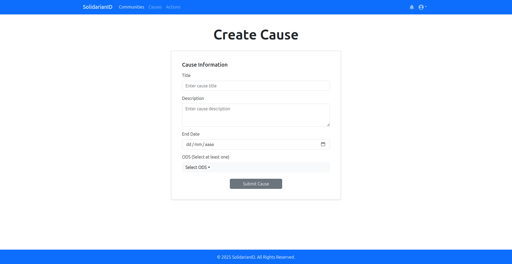

- **Cause details (cause by ID)**

  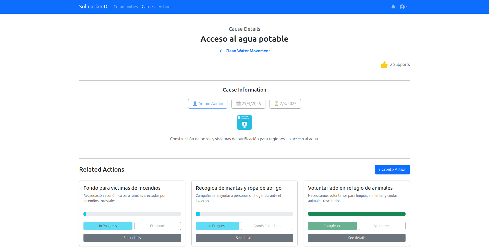

### Actions

- **List of actions**

  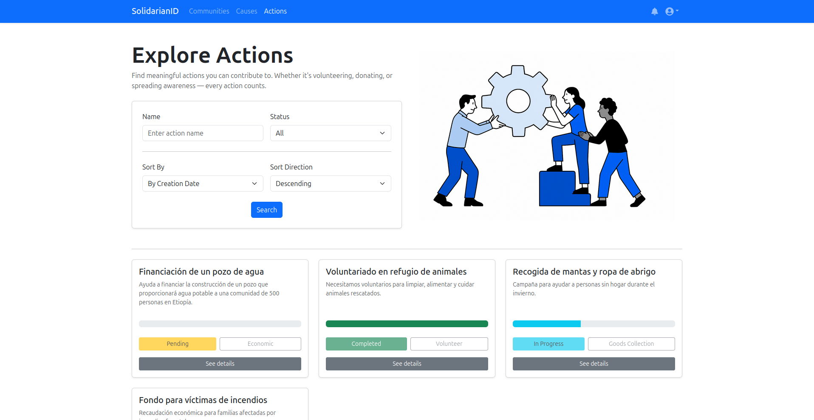

- **Action details within a cause**

  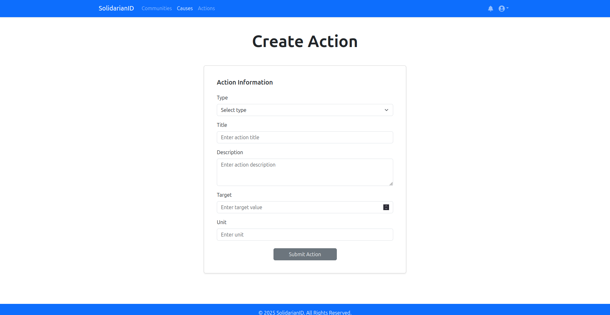

- **Specific action details (action by ID)**

  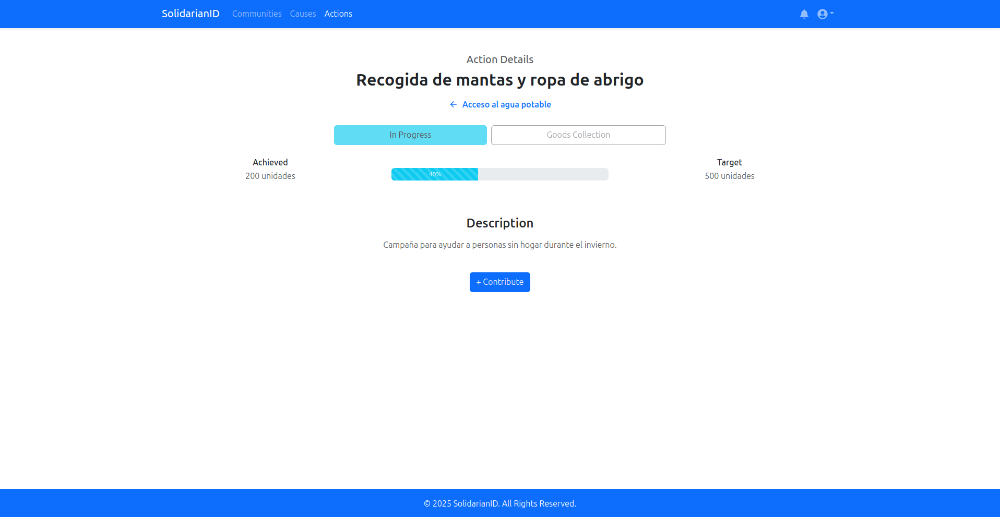

---

> **Note:** All associated routes correspond to views developed in the SolidarianID project frontend.
